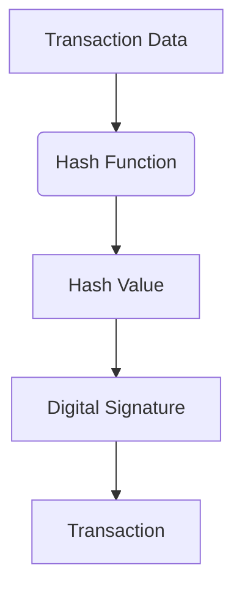

import { Callout, Steps, Step } from "nextra-theme-docs";

# Cryptography and Hashing

Cryptography and hashing are fundamental components of blockchain technology. They ensure the security, integrity, and immutability of the data stored on the blockchain.

## Hashing Algorithms

Hashing algorithms, such as SHA-256 and Keccak-256 (also known as SHA-3), play a crucial role in blockchain. These algorithms take an input of arbitrary length and produce a fixed-size output, called a hash. The hash functions used in blockchain have several important properties:

1. **One-Way**: It is computationally infeasible to recover the original input from the hash output. This means that hashes are irreversible, making them suitable for protecting sensitive data.

2. **Deterministic**: The same input will always produce the same hash output. This property ensures that the hash value is a unique "fingerprint" of the data.

3. **Collision-Resistant**: It is computationally infeasible to find two different inputs that produce the same hash output. This property helps prevent tampering with the data, as even a small change in the input will result in a completely different hash.

<Callout type="info">
The SHA-256 and Keccak-256 algorithms used in blockchain are considered secure, with a large number of possible hash values (2^256 and 2^256, respectively). This makes it extremely difficult to find collisions or reverse the hashing process.
</Callout>

## The Role of Hashing in Blockchain

In blockchain, hashing is used for several critical purposes:

1. **Merkle Trees**: Transactions in a block are organized into a Merkle tree, where each transaction is hashed, and the hashes of the child nodes are concatenated and hashed to form the parent node. This allows for efficient verification of the inclusion of a transaction within a block.

2. **Block Hashing**: Each block in the blockchain contains the hash of the previous block, creating a "chain" of blocks. This chain of hashes ensures the immutability of the blockchain, as any modification to a previous block will change its hash, effectively breaking the chain.

3. **Digital Signatures**: Blockchain uses public-key cryptography, where users have a private key and a derived public key. Transactions are signed using the private key, and the public key is used to verify the signature. The hashing of the transaction data is an essential part of this digital signature process.

4. **Proof of Work**: In the Proof of Work consensus mechanism, miners compete to solve a cryptographic puzzle, which involves finding a hash value that meets certain criteria. This process is computationally intensive and ensures the security of the blockchain.

## ECDSA and Elliptic Curve Cryptography

Elliptic Curve Digital Signature Algorithm (ECDSA) is a specific type of digital signature algorithm used in blockchain, built upon the principles of elliptic curve cryptography (ECC). ECC uses the algebraic structure of elliptic curves over finite fields to provide a more efficient and secure alternative to traditional public-key cryptography, such as RSA.

The key advantages of using ECDSA in blockchain include:

1. **Smaller Key Sizes**: ECDSA keys are significantly smaller than RSA keys, typically 256 bits compared to 2048 bits or more for RSA. This reduces storage requirements and improves performance.

2. **Higher Security**: Elliptic curve cryptography is believed to be more secure than RSA for the same key size, making it a better fit for blockchain's security needs.

3. **Computational Efficiency**: ECDSA operations, such as signing and verification, are generally faster than their RSA counterparts, which is important for the high-throughput requirements of blockchain networks.

The combination of hashing algorithms and ECDSA-based digital signatures is a powerful tool that ensures the security and integrity of blockchain transactions and data.

## Key Takeaways

- Hashing algorithms like SHA-256 and Keccak-256 are essential for blockchain, providing one-way, deterministic, and collision-resistant properties.
- Hashing is used in Merkle trees, block hashing, and digital signatures to ensure the integrity and immutability of the blockchain.
- ECDSA, built on elliptic curve cryptography, provides a more efficient and secure alternative to traditional public-key cryptography for blockchain applications.
- The integration of hashing and ECDSA-based digital signatures is a cornerstone of blockchain's security and trust model.

For a deeper understanding of the technical details and implementation of cryptography and hashing in blockchain, I recommend exploring the [Introduction to Blockchain](/blockchain-fundamentals/introduction-to-blockchain) and [Consensus Mechanisms](/blockchain-fundamentals/consensus-mechanisms) sections.