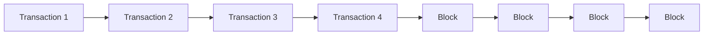

import { Callout, Steps, Step } from "nextra-theme-docs";

# Introduction to Blockchain

Blockchain technology has fundamentally transformed the way we think about digital transactions, data storage, and trust in distributed systems. At its core, a blockchain is a decentralized, distributed digital ledger that records transactions across many computers in a network. Let's dive into the key concepts and inner workings of this revolutionary technology.

## Decentralization and Distributed Nature

The defining feature of a blockchain is its decentralized and distributed nature. Instead of a central authority or server controlling the entire network, blockchain networks are maintained by a network of nodes, each with a copy of the shared ledger. This distribution of data and computing power across the network ensures that there is no single point of failure and enhances the overall resilience of the system.

<Callout type="info">
Decentralization is a core principle of blockchain technology, as it allows for transparent and tamper-resistant data storage and transaction processing without the need for a central authority.
</Callout>

## Blocks and Chaining

The "chain" in blockchain refers to the way data is structured. Transactions are grouped into blocks, and each block is cryptographically linked to the previous block, forming a chain of blocks. This chaining process is what gives blockchain its immutable and transparent nature, as any attempt to modify a past transaction would require changing the entire subsequent chain of blocks.

## Consensus Mechanisms

Blockchain networks use consensus mechanisms to ensure that all nodes in the network agree on the state of the shared ledger. The most well-known consensus mechanism is [Proof of Work (PoW)](/blockchain-fundamentals/consensus-mechanisms#proof-of-work), which requires nodes to solve complex mathematical problems to validate transactions and add new blocks to the chain. Other consensus mechanisms, such as [Proof of Stake (PoS)](/blockchain-fundamentals/consensus-mechanisms#proof-of-stake) and [Proof of Authority (PoA)](/blockchain-fundamentals/consensus-mechanisms#proof-of-authority), have also been developed to address the limitations of PoW.

<Callout type="warning">
Consensus mechanisms are crucial in ensuring the security and integrity of a blockchain network, as they prevent a single entity from unilaterally controlling the ledger.
</Callout>

## Cryptography and Hashing

Blockchain technology heavily relies on cryptography and hashing algorithms to secure the network and ensure the integrity of data. Transactions are digitally signed using public-key cryptography, and the blocks are linked together using cryptographic hashes, which create a unique digital fingerprint for each block.

The use of cryptography and hashing is what makes blockchain data immutable and secure, as any attempt to tamper with a single block would invalidate the entire chain.

## Applications of Blockchain

Blockchain technology has a wide range of applications beyond the well-known use case of cryptocurrencies. Some other applications include supply chain management, digital identity, voting systems, healthcare data management, and decentralized finance (DeFi). The versatility of blockchain allows it to revolutionize various industries by providing a secure, transparent, and decentralized platform for data management and transaction processing.

In summary, the introduction to blockchain covers the core concepts of decentralization, distributed ledgers, blocks and chaining, consensus mechanisms, and cryptography. Understanding these fundamental aspects of blockchain technology is crucial for anyone interested in exploring the potential of this disruptive innovation.