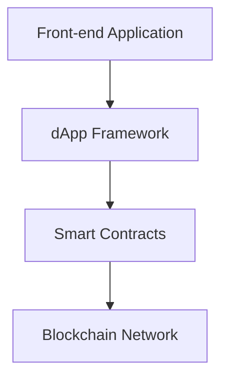

import { Callout, Steps, Step } from "nextra-theme-docs";

# Decentralized Applications (DApps)

Decentralized applications, or DApps, are a fundamental component of the blockchain ecosystem. These applications are built on top of blockchain networks, leveraging the inherent decentralization, transparency, and security provided by the underlying blockchain infrastructure.

DApps differ from traditional centralized applications in several key ways. Unlike centralized apps that rely on a single point of control, DApps are powered by smart contracts deployed on the blockchain, ensuring that the application logic is distributed and tamper-resistant. This decentralized architecture eliminates the need for a central authority, promoting transparency, censorship resistance, and trust among users.

One of the primary benefits of DApps is their ability to facilitate peer-to-peer transactions and interactions without the involvement of intermediaries. This enables new and innovative use cases in areas such as finance, gaming, social media, and beyond. By removing the need for trusted third parties, DApps can offer enhanced privacy, security, and control for users over their data and assets.

## Introduction to DApps

[Intro to DApps section](/decentralized-applications-dapps/introduction-to-dapps)

## DApp Development

[DApp Development section](/decentralized-applications-dapps/dapp-development)

## Interacting with Smart Contracts

[Interacting with Smart Contracts section](/decentralized-applications-dapps/interacting-with-smart-contracts)

## The DApp Architecture

At the core of a DApp is the interaction between the front-end application and the underlying smart contracts deployed on the blockchain. This interaction is facilitated by a middleware layer, often referred to as a "dApp framework," which allows developers to seamlessly connect their front-end application with the blockchain network.

<Callout type="info">
The dApp framework typically includes features such as wallet integration, transaction signing, and event handling, abstracting away the complexities of directly interacting with the blockchain.
</Callout>

The architecture of a DApp can be represented using the following diagram:

In this architecture, the front-end application communicates with the dApp framework, which in turn interacts with the deployed smart contracts on the blockchain network. This separation of concerns allows developers to focus on building the user-facing application while leveraging the power and security of the underlying blockchain.

By adopting this decentralized approach, DApps can offer several benefits, including:

- **Transparency**: All transactions and application logic are recorded on the public blockchain, ensuring transparency and auditability.
- **Trustless Interactions**: DApps eliminate the need for trusted intermediaries, enabling direct peer-to-peer transactions and interactions.
- **Censorship Resistance**: DApps are resistant to censorship, as they are not controlled by a single entity.
- **Programmability**: DApps leverage smart contracts, which allow for the encoding of complex business logic and automated execution of transactions.
- **Permissionless Innovation**: The open and decentralized nature of blockchain networks enables anyone to build and deploy DApps, fostering a thriving ecosystem of innovative applications.

As the blockchain ecosystem continues to evolve, the development and adoption of DApps are expected to play a crucial role in shaping the future of decentralized technologies and their real-world applications.