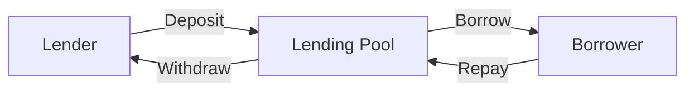

import { Callout, Steps, Step } from "nextra-theme-docs";

# DeFi Lending Platforms

Decentralized lending platforms are a core component of the DeFi ecosystem, enabling users to lend, borrow, and earn interest on their digital assets in a trustless, transparent manner. These platforms leverage smart contracts and automated processes to facilitate lending activities, eliminating the need for traditional financial intermediaries.

## Aave: A Leading DeFi Lending Protocol

[Aave](/defi-use-cases-and-projects/defi-lending-platforms/aave) is one of the most prominent decentralized lending platforms in the DeFi space. Aave allows users to supply their crypto assets as liquidity, which are then borrowed by other users. Lenders earn interest on their supplied assets, while borrowers pay interest on the amount they borrow. Aave utilizes a unique *Aave Safety Module* to provide additional protection for lenders against potential smart contract vulnerabilities or protocol failures.

## Compound: Pioneering Decentralized Lending

[Compound](/defi-use-cases-and-projects/defi-lending-platforms/compound) is another widely adopted DeFi lending protocol that pioneered the concept of decentralized lending. Compound allows users to lend and borrow a variety of cryptocurrencies, including popular assets like Ethereum, USDC, and DAI. The protocol uses an *algorithmic interest rate model* to dynamically adjust lending and borrowing rates based on supply and demand.

## Understanding the Lending Mechanism

Decentralized lending platforms typically follow a similar lending mechanism, which can be illustrated using the following mermaid diagram:

1. **Lenders**: Users who deposit their crypto assets into the lending pool to earn interest.
2. **Lending Pool**: A smart contract-based pool that holds the deposited assets and manages the lending and borrowing activities.
3. **Borrowers**: Users who borrow assets from the lending pool by providing collateral, typically in the form of other crypto assets.
4. **Repayment**: Borrowers repay their loans, including the principal and interest, back into the lending pool.
5. **Withdrawal**: Lenders can withdraw their deposited assets, including the earned interest, from the lending pool.

The lending platforms use various risk management techniques, such as *over-collateralization*, *liquidation mechanisms*, and *reserve factors*, to ensure the stability and sustainability of the lending ecosystem.

## Yield Optimization Strategies

In addition to the core lending and borrowing functionalities, DeFi lending platforms often integrate with other DeFi protocols to offer *yield optimization strategies*. These strategies allow users to maximize the returns on their deposited assets by automatically re-investing or compounding the earned interest. [Yearn Finance](/defi-use-cases-and-projects/defi-lending-platforms/yearn-finance) is a prominent example of a DeFi platform that provides such yield optimization services.

## Risks and Considerations

While DeFi lending platforms offer significant benefits, users should be aware of the potential risks, such as:

- **Smart Contract Vulnerabilities**: Carefully review the security audits and track record of the lending protocol before depositing funds.
- **Liquidation and Collateral Risks**: Ensure that the collateral provided is sufficient to avoid liquidation in case of market volatility.
- **Regulatory Uncertainty**: Stay informed about the evolving regulatory landscape surrounding DeFi lending activities.

It's essential to conduct thorough research, understand the protocol's mechanics, and carefully manage the risks before engaging with DeFi lending platforms.

## Conclusion

Decentralized lending platforms have become a fundamental building block of the DeFi ecosystem, providing users with new opportunities to lend, borrow, and earn yields on their digital assets. As the DeFi space continues to evolve, these lending protocols are likely to play an increasingly important role in the future of finance.